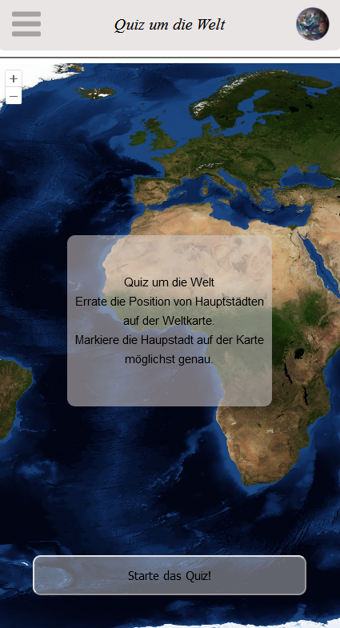

# Description
Guess the position of capitals on the world map. Mark the  
capital on the map as accurately as possible. Use the  
button below to find out the distance from the capital  
to your marker, then continue. If no entry is made, the  
next question will appear after 20 seconds.

Conversions from spherical image coordinates to distances  
in longitude base units (metres) are made using the  
Haversine formula.

Choose for example Netlify to easily deploy the application.  

See below iamge of the start, answer and end state of the  
application as an example.
<p float="left">
	
	
	
</p>
# Licence

Map material is provided by  
[Nasa Blue Marble](https://visibleearth.nasa.gov/collection/1484/blue-marble)

For the presentation of the map and geographical conversions, 
the following framework is used:  
[OpenLayers](https://openlayers.org/)

This web application is made with Vue3:  
[VueJS](https://vuejs.org/)

To save game statistics, Supbase is used:  
[Supabase](https://supabase.io/)

## Project Setup

```sh
npm install
```

### Compile and Hot-Reload for Development

```sh
npm run dev
```

### Compile and Minify for Production

```sh
npm run build
```
